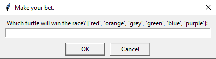

# Turtle Race
> Choose your turtle and bet if he can win the race.

## Table of contents
* [General info](#general-info)
* [Screenshots](#screenshots)
* [Technologies](#technologies)
* [Setup](#setup)
* [Status](#status)

## General info
There are six turtles with different colours generated on the START line. Player chooses one and waits until the end of the race.
After the first turtle cross the END line, race ends and player gets appropriate feedback.

Every turtle step size is random.

Main goal of the project was to practice with turtle library.

## Screenshots
\

## Technologies
* Python 3.8
* Turtle 3.9.5

## Setup
Install missing libraries if necessary.

## Status
Project is: _finished_.
